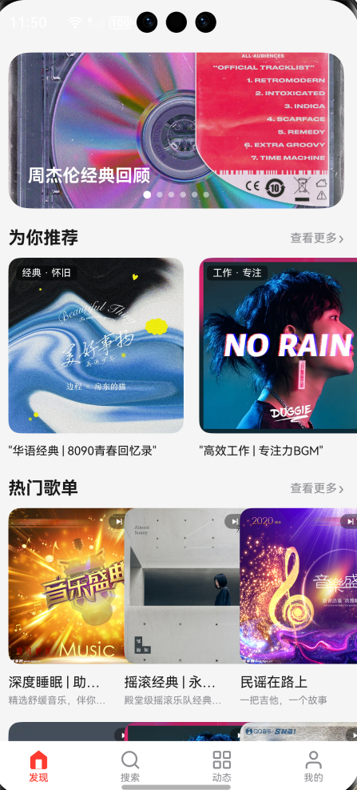
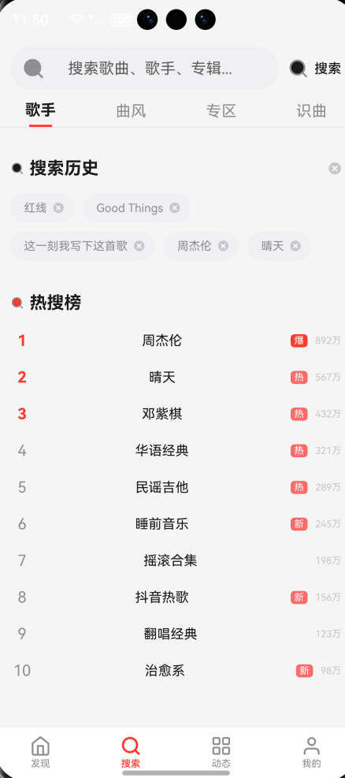
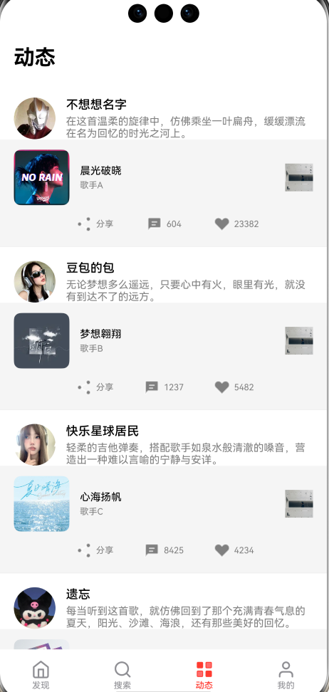
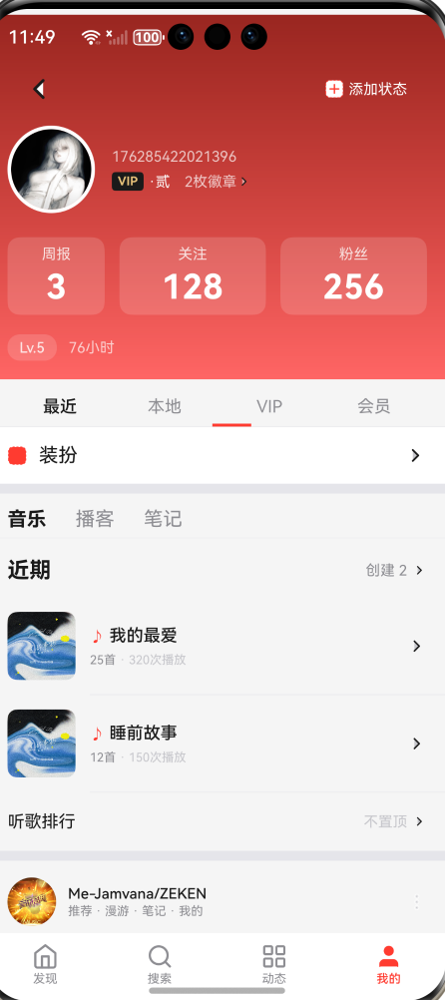
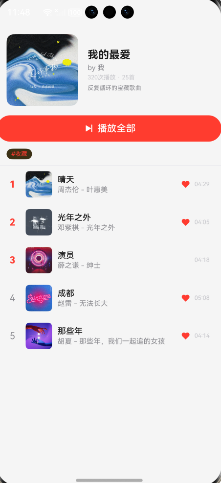
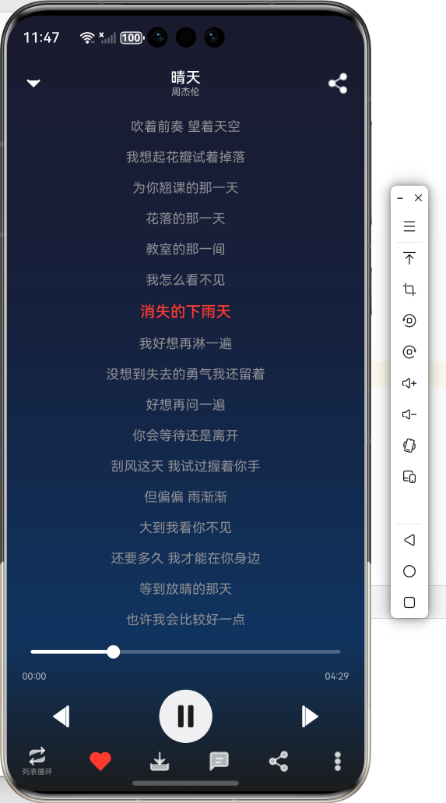

# HarmonyOS Music Player
基于HarmonyOS NEXT，ArkTS开发的鸿蒙音乐播放器应用。

## ui设计

## 项目介绍
本音乐播放器包含**发现、搜索、动态、我的**四大底部模块。实现歌单推荐、热搜检索、音乐社交动态、个人歌单收藏管理；内置播放页面，支持进度拖动、歌词滚动高亮、切歌、歌曲收藏等基础播放功能。项目采用本地模拟数据，界面完整，复刻主流音乐App交互体验。

## 技术栈
- 开发框架：HarmonyOS NEXT
- 开发语言：ArkTS
- UI：ArkUI
- 构建工具：Hvigor

## 功能清单
- 发现页：轮播图、推荐歌单、热门歌单展示
- 搜索页：搜索框、搜索历史、音乐热搜榜
- 动态页：用户音乐分享动态，点赞评论
- 我的页面：个人主页、收藏歌单、播放记录
- 播放页：歌词滚动高亮、播放进度调节、切歌、收藏、循环模式

## 运行方式
1. 使用DevEco Studio打开项目
2. 配置HarmonyOS NEXT SDK
3. 模拟器/真机运行entry模块

